<div align="center">

<h3> Guided Slot Attention for Unsupervised Video Object Segmentation
 </h3> 
 <br/>
  <a href='https://arxiv.org/abs/2303.08314'></a> 
</div>

[](https://paperswithcode.com/sota/unsupervised-video-object-segmentation-on-10?p=guided-slot-attention-for-unsupervised-video)
[](https://paperswithcode.com/sota/unsupervised-video-object-segmentation-on-11?p=guided-slot-attention-for-unsupervised-video)

## What do we offer?
### Guided Slot Attention for Unsupervised Video Object Segmentation

This project presents an implementation of Guided Slot Attention for Unsupervised Video Object Segmentation, with an emphasis on the DAVIS 2017 dataset. The project offers an interactive Google Colab notebook for training and experimentation, along with a Streamlit app for visualizations and practical applications (We only use 5 epoches for training, so the result is not too effective)

### Google Colab Notebook
- **Train and Experiment on DAVIS 2017 Dataset**: The Colab notebook allows you to train and experiment with Guided Slot Attention on the DAVIS 2017 dataset, which you can find more information about [here](https://davischallenge.org/davis2017/code.html).
- **Access the Notebook**: [Open the Colab notebook](https://colab.research.google.com/drive/1-9mWsiESYqvbxr5v1behDRkN1h3mBFEV) to get started.
- **Sample Results**: Below are sample frames generated from the model's segmentation on the DAVIS 2017 dataset.

<p align="center">
    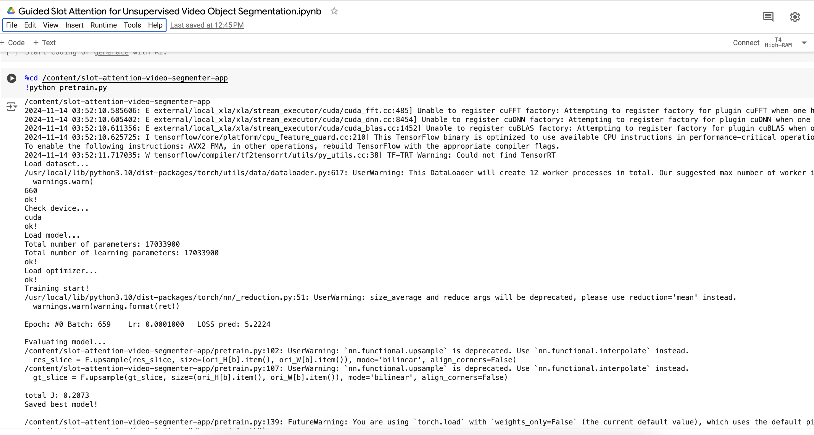
</p>
<p align="center">
    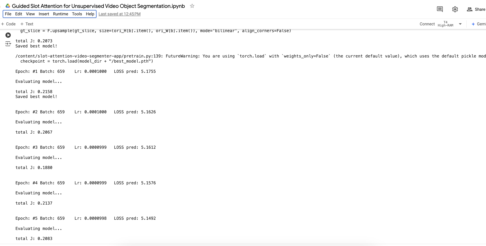
</p>

### Streamlit App for Image and Video Segmentation

Welcome to our interactive **Image and Video Segmentation** app, built with Streamlit. This application leverages Guided Slot Attention for background removal, image segmentation, and video segmentation, offering an intuitive, user-friendly interface to explore advanced segmentation techniques.

#### 🚀 Features

##### Interactive Visualization
The app allows users to visualize segmentation results interactively, providing an intuitive way to explore the model's performance on both images and video sequences.

##### Capabilities
- **Image Segmentation**: Upload any image, and the app will segment and separate the foreground, allowing for custom background replacements.
- **Video Segmentation**: Process video frames in real-time to identify and segment objects across the sequence.
- **Background Removal with Custom Backgrounds**: Easily remove the background from images and replace it with a custom background, ideal for content creators and marketing materials.

##### User Interface Preview

<p align="center">
    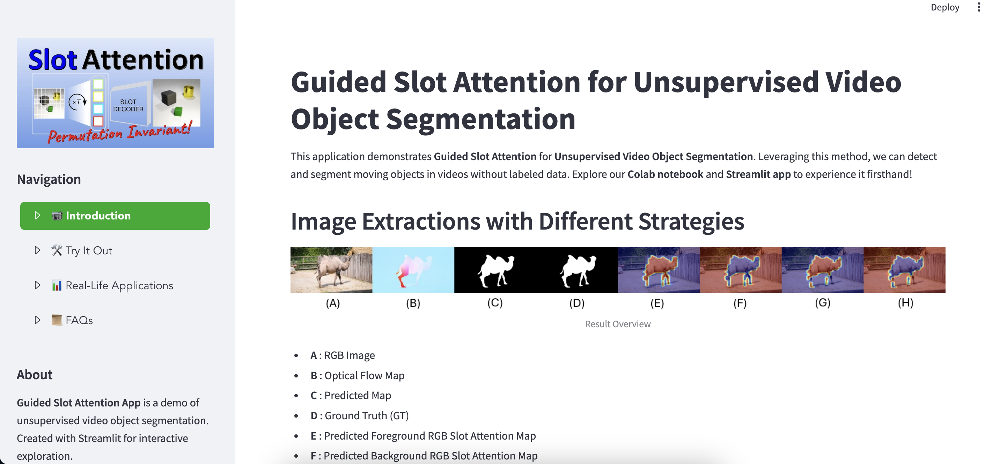
    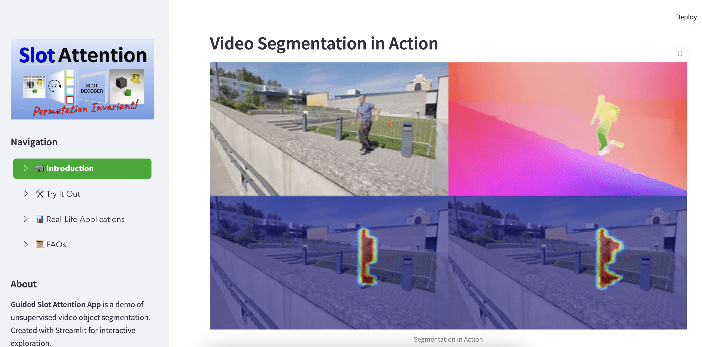
    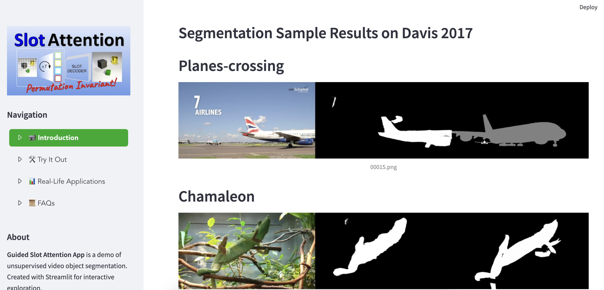
    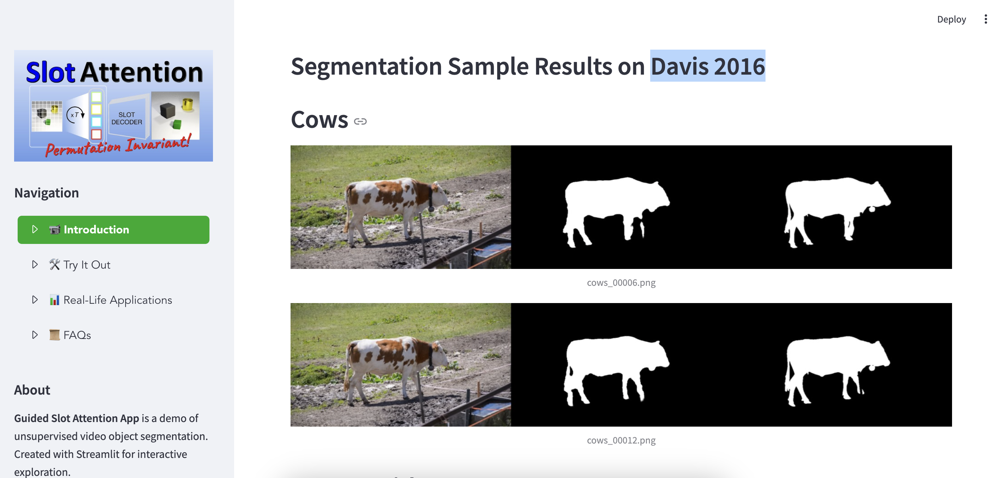
    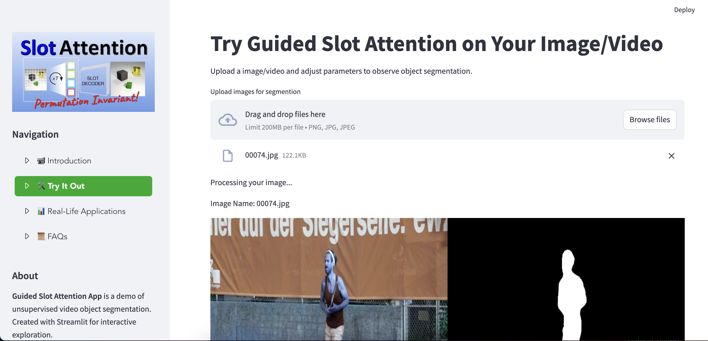
    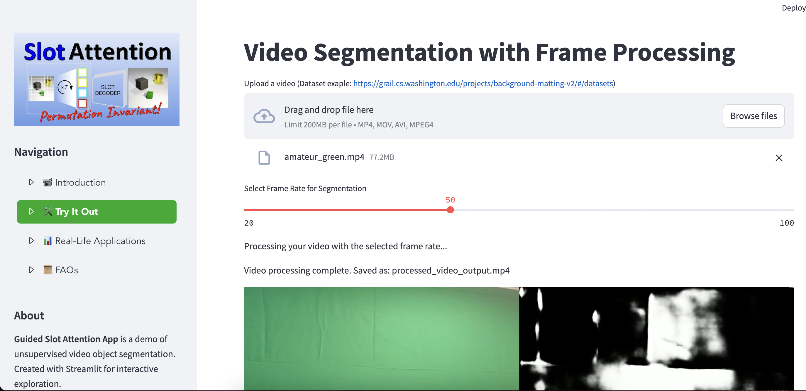
    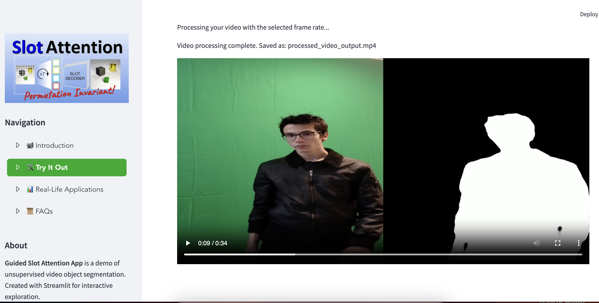
    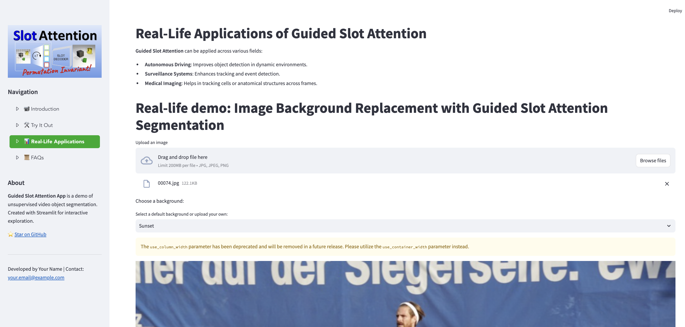
    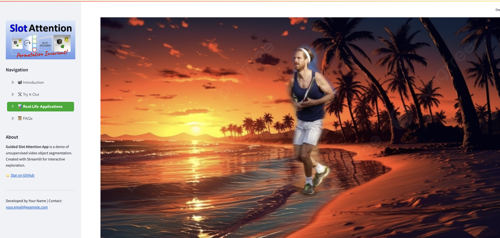
</p>

### Real-Life Applications
The approach discussed in this project has several promising real-life applications, such as:
- **Autonomous Driving**: Enhancing object detection in dynamic environments.
- **Surveillance Systems**: Improving object tracking and event detection for security monitoring.
- **Medical Imaging**: Assisting in tracking moving elements, such as cells or anatomical structures, across medical video sequences.

## Abstract
Unsupervised video object segmentation aims to segment the most prominent object in a video sequence. However, the existence of complex backgrounds and multiple foreground objects make this task challenging. To address this issue, we propose a guided slot attention network to reinforce spatial structural information and obtain better foreground--background separation. The foreground and background slots, which are initialized with query guidance, are iteratively refined based on interactions with template information. Furthermore, to improve slot--template interaction and effectively fuse global and local features in the target and reference frames, K-nearest neighbors filtering and a feature aggregation transformer are introduced. The proposed model achieves state-of-the-art performance on two popular datasets. Additionally, we demonstrate the robustness of the proposed model in challenging scenes through various comparative experiments.

## Overview
<p align="center">
  
</p>


## Requirements
We use [fast_pytorch_kmeans](https://github.com/DeMoriarty/fast_pytorch_kmeans) for the GPU-accelerated Kmeans algorithm.
```
pip install fast-pytorch-kmeans
```

## Datasets
We use the [DUTS](http://saliencydetection.net/duts) train dataset for model pretraining and the [DAVIS 2016](https://davischallenge.org/davis2016/code.html) dataset for fintuning. For [DAVIS 2016](https://davischallenge.org/davis2016/code.html), [RAFT](https://github.com/princeton-vl/RAFT) is used to generate optical flow maps. The complete dataset directory structure is as follows:

```
dataset dir/
├── DUTS_train/
│   ├── RGB/
│   │   ├── sun_ekmqudbbrseiyiht.jpg
│   │   ├── sun_ejwwsnjzahzakyjq.jpg
│   │   └── ...
│   └── GT/
│       ├── sun_ekmqudbbrseiyiht.png
│       ├── sun_ejwwsnjzahzakyjq.png
│       └── ...
├── DAVIS_train/
│   ├── RGB/
│   │   ├── bear_00000.jpg
│   │   ├── bear_00001.jpg
│   │   └── ...
│   ├── GT/
│   │   ├── bear_00000.png
│   │   ├── bear_00001.png
│   │   └── ...
│   └── FLOW/
│       ├── bear_00000.jpg
│       ├── bear_00001.jpg
│       └── ...
└── DAVIS_test/
    ├── blackswan/
    │   ├── RGB/
    │   │   ├── blackswan_00000.jpg
    │   │   ├── blackswan_00001.jpg
    │   │   └── ...
    │   ├── GT/
    │   │   ├── blackswan_00000.png
    │   │   ├── blackswan_00001.png
    │   │   └── ...
    │   └── FLOW/
    │       ├── blackswan_00000.jpg
    │       ├── blackswan_00001.jpg
    │       └── ...
    ├── bmx-trees
    └── ...
```

## Training Model
We use a two-stage learning strategy: pretraining and finetuning.

### Pretraining
1. Edit config.py. The data root path option and GPU index should be modified.
2. training
```
python pretrain.py
```

### Finetuning
1. Edit config.py. The best model path generated during the pretraining process is required.
2. training
```
python train.py
```

## Evaluation
TBD

## Result
An example of the resulting image is shown below.
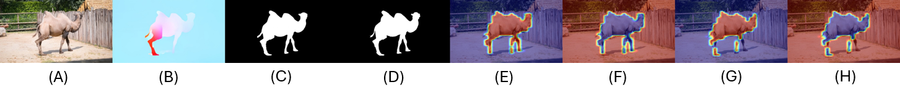

* A : RGB image
* B : Optical Flow map
* C : Pred map
* D : GT
* E : Pred forground RGB slot attention map
* F : Pred background RGB slot attention map
* G : Pred forground Flow slot attention map
* H : Pred background Flow slot attention map

## Citation
```
@InProceedings{Lee_2024_CVPR,
    author    = {Lee, Minhyeok and Cho, Suhwan and Lee, Dogyoon and Park, Chaewon and Lee, Jungho and Lee, Sangyoun},
    title     = {Guided Slot Attention for Unsupervised Video Object Segmentation},
    booktitle = {Proceedings of the IEEE/CVF Conference on Computer Vision and Pattern Recognition (CVPR)},
    month     = {June},
    year      = {2024},
    pages     = {3807-3816}
}
```
